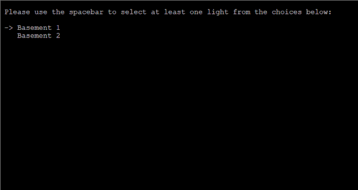
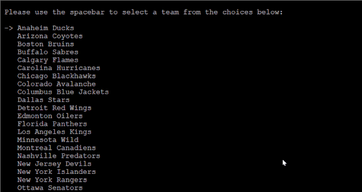

# Woohue

**Woohue** is a Python program that retrieves information from the public NHL API, and triggers a goal light celebration on color capable Philips Hue lights.

Note: The NHL live score API is updated every 60 seconds, thus if you're watching live on TV the celebration could be triggered up to 59 seconds after a goal is scored.  I've had excellent results while watching through a streaming app such as NBC Sports.

## Installation
    enter code here

## Setup
### Start Bridge Discovery

### Select Lights

### Pick your team

 Upon successful writing of the config file, your goal lights should activate.
  
   

## Requirements
 - Add requirements

## Known Issues
 - Some terminals / console emulators may have issues with the curses library (I experienced errors with Cygwin / ConEmu).  PuTTY has been tested and works for Raspberry Pi SSH connection.
